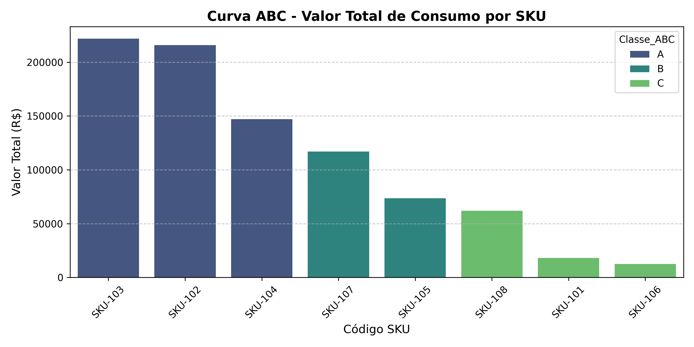

# 📦 Otimização de Estoque MRO & Matriz ABC/XYZ para Operações Industriais

## 📌 Visão Geral do Projeto

Este projeto consolida um modelo matemático e analítico para a **otimização de estoques MRO (Manutenção, Reparo e Operação)** em ambientes de alta criticidade operacional (indústrias siderúrgicas, terminais portuários e bases offshore em Macaé/RJ).

O objetivo principal é equilibrar o **capital de giro investido** com a **garantia do nível de serviço**, evitando rupturas de estoque (*stockouts*) em itens cruciais que podem causar a paralisação de plantas ou sondas de perfuração.

---

## 📊 Matriz de Classificação ABC/XYZ e Níveis de Estoque

A análise integra a perspectiva financeira (**Curva ABC**) com a criticidade operacional dos ativos (**Classificação XYZ**):

| Código SKU | Descrição do Item | Custo Unitário | Consumo Anual | Classe ABC | Matriz ABC/XYZ | Lead Time | Estoque Seg. (ES) | Ponto Pedido (ROP) |
| :--- | :--- | :---: | :---: | :---: | :---: | :---: | :---: | :---: |
| **SKU-103** | Eixo de Transmissão Inox | R$ 18.500,00 | 12 un | **Classe A** | **AZ** | 60 dias | **1 un** | **3 un** |
| **SKU-102** | Válvula Esfera Flangeada 4" | R$ 4.800,00 | 45 un | **Classe A** | **AZ** | 45 dias | **3 un** | **9 un** |
| **SKU-104** | Óleo Lubrificante Sintético 20L | R$ 420,00 | 350 un | **Classe A** | **AY** | 10 dias | **5 un** | **15 un** |
| **SKU-107** | Filtro Coalescente de Alta Pressão | R$ 650,00 | 180 un | **Classe B** | **BY** | 15 dias | **4 un** | **12 un** |
| **SKU-105** | Sensor de Tremor de Vibração | R$ 9.200,00 | 8 un | **Classe B** | **BZ** | 30 dias | **1 un** | **2 un** |
| **SKU-108** | Placa de Circuito para CLP | R$ 12.400,00 | 5 un | **Classe C** | **CZ** | 40 dias | **1 un** | **2 un** |
| **SKU-101** | Anel de Vedação Viton O-Ring | R$ 15,00 | 1.200 un | **Classe C** | **CX** | 7 dias | **12 un** | **35 un** |
| **SKU-106** | Conjunto Porcas/Parafusos Inox | R$ 2,50 | 5.000 un | **Classe C** | **CX** | 5 dias | **35 un** | **104 un** |

---

## 📈 Distribuição do Consumo Anual (Curva ABC)

### 🚨 Principais Insights Analíticos:
* **Concentração Financeira (Classe A):** Apenas 3 SKUs representam **80% do valor total consumido no ano** (R$ 585.000,00 de um total de R$ 866.100,00).
* **Gargalos Operacionais (Itens Z):** Os itens `SKU-103` (Eixo Inox) e `SKU-102` (Válvula Flangeada) combinam **alto valor financeiro (Classe A)** com **alta criticidade operacional e longo tempo de reposição (Lead Time de 45 a 60 dias)**.

---

## 💡 Diretrizes de Gestão e Plano de Ressuprimento (TO-BE)

1. **Gestão Estratégica de Itens AZ (Gargalo Crítico):**
   * Negociar contratos guarda-chuva com fornecedores para manter **Estoque Consignado** próximo à operação, reduzindo o *Lead Time* de 60 para até 5 dias.
2. **Automação do Ponto de Pedido (ROP):**
   * Configurar gatilhos automáticos no sistema ERP/WMS assim que o saldo físico atingir o Ponto de Pedido calculado para evitar compras emergenciais com frete expresso (*Spot*).
3. **Revisão Periódica dos Parâmetros:**
   * Recalcular o Estoque de Segurança trimestralmente para acompanhar variações de demanda de manutenção preventiva e corretiva.

---

## 🤖 Módulo de Automação de Decisões e Alertas Operacionais (TO-BE)

Para transformar a análise estática em um **sistema ativo de recomendação**, o modelo em Python simula o saldo de estoque físico em tempo real (integração via ERP/WMS) e executa regramentos automáticos de negócio:

### 🚨 Painel Executivo de Alertas e Ordens Sugeridas

| Código SKU | Item MRO | Matriz | Estoque Atual | ROP | Status do Alerta | Qtd. Sugerida | Estratégia de Fornecedor | Revisão ROP |
| :--- | :--- | :---: | :---: | :---: | :--- | :---: | :--- | :---: |
| **SKU-105** | Sensor Vibração | **BZ** | 1 un | 2 un | 🚨 **URGENTE: RISCO RUPTURA** | 3 un | Contrato VMI / Consignado | Trimestral |
| **SKU-103** | Eixo Transmissão | **AZ** | 2 un | 3 un | ⚠️ **EMITIR ORDEM COMPRA** | 4 un | Contrato VMI / Consignado | Mensal |
| **SKU-101** | Anel de Vedação | **CX** | 30 un | 36 un | ⚠️ **EMITIR ORDEM COMPRA** | 42 un | Compra por Lote / Cartão | Semestral |
| **SKU-106** | Porcas/Parafusos | **CX** | 90 un | 104 un | ⚠️ **EMITIR ORDEM COMPRA** | 118 un | Compra por Lote / Cartão | Semestral |
| **SKU-102** | Válvula Flangeada | **AZ** | 8 un | 9 un | ⚠️ **EMITIR ORDEM COMPRA** | 10 un | Contrato VMI / Consignado | Mensal |
| **SKU-104** | Óleo Lubrificante | **AY** | 14 un | 15 un | ⚠️ **EMITIR ORDEM COMPRA** | 16 un | Contrato Guarda-Chuva | Mensal |

---

### 💡 Regras de Negócio Implementadas no Algoritmo

* **Gatilhos Automáticos de Compra:** O algoritmo compara continuamente o saldo físico com o Ponto de Pedido (ROP) e aciona o alerta de ruptura quando o saldo atinge o Estoque de Segurança.
* **Cálculo da Ordem Sugerida:** Elimina o cálculo manual calculando automaticamente a quantidade exata para reabastecimento ideal: $\text{Qtd Sugerida} = (\text{ROP} \times 2) - \text{Estoque Atual}$.
* **Governança por Criticidade:** 
  * Itens de alta criticidade (**Matriz Z**) acionam sugestão de **Contrato VMI (Vendor Managed Inventory)** com estoque consignado para garantir SLA de entrega em até 5 dias.
  * Frequência de revisão dos parâmetros de estoque definida pelo valor financeiro (Classe A = Mensal | Classe B = Trimestral | Classe C = Semestral).
---

## 🛠️ Tecnologias e Ferramentas Utilizadas
* **Python (Pandas, NumPy, Matplotlib, Seaborn):** Modelagem estocástica do estoque de segurança, cálculo de curva ABC/XYZ e visualizações.
* **Google Sheets:** Coleta e estruturação da base de dados MRO.
* **GitHub:** Documentação técnica e controle de versões do projeto.
